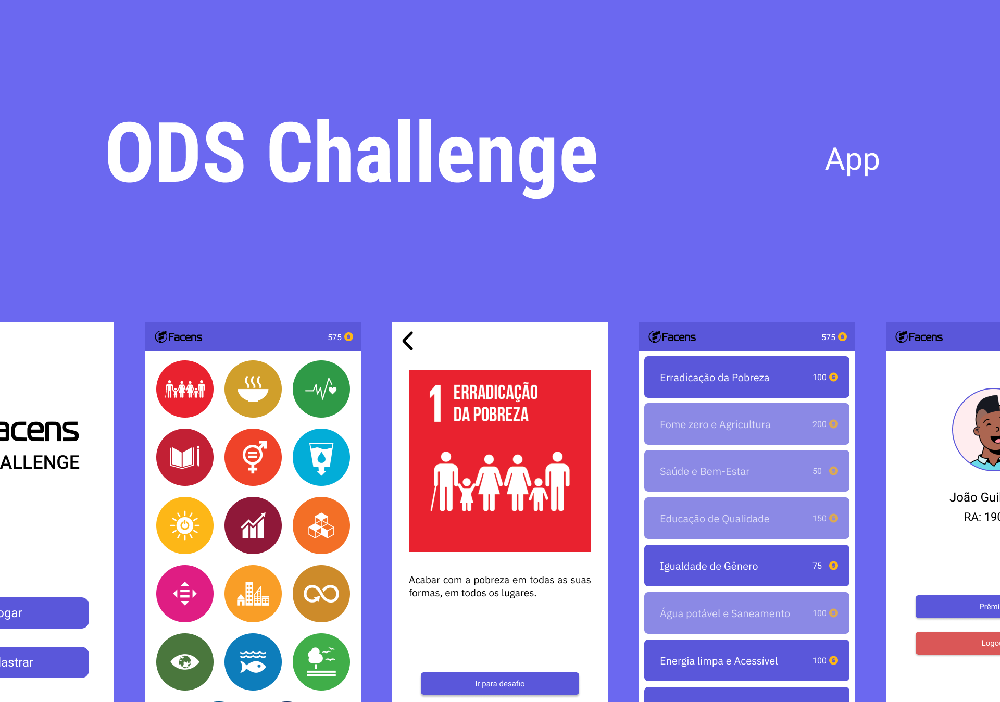

<h1 align="center">
  
 </h1>
 
 

  <a href="#-tecnologias">Tecnologias</a>&nbsp;&nbsp;&nbsp;|&nbsp;&nbsp;&nbsp;
  <a href="#-projeto">Projeto</a>&nbsp;&nbsp;&nbsp;|&nbsp;&nbsp;&nbsp;
  <a href="#-layout">Layout</a>

 

  

---

## 🧪 Tecnologias

Esse projeto foi desenvolvido usando as seguintes tecnologias:

- [React Native](https://reactnative.dev/)
- [Firebase](https://firebase.google.com/?hl=pt-br)
- [Qr Code Scanner](https://github.com/moaazsidat/react-native-qrcode-scanner)
- [React Navigation](https://reactnavigation.org/)
- [Styled Components](https://styled-components.com/)

## 💻 Projeto

App para incentivar as pessoas a seguir os objetivos da ODS 🌎

## 🔖 Layout

Você pode ver o layout do projeto através do link abaixo:

- [Layout](https://www.figma.com/file/vQnMSUEUDfwaZG6lCGBQuW/ODS?node-id=0%3A1) 

